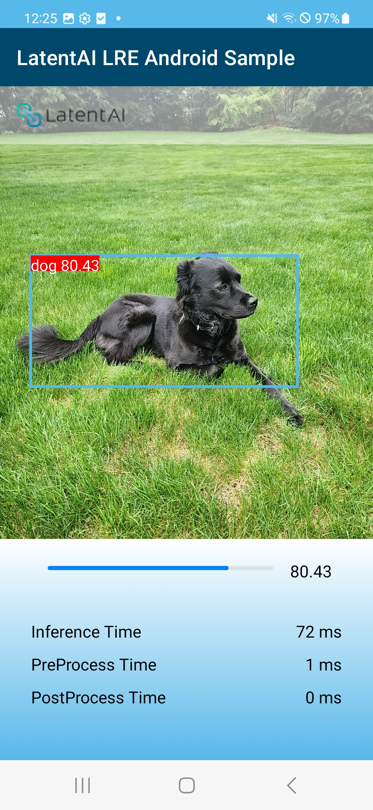

# Latent AI Android LRE Example Application

This example application demostrates how to use the Android Latent Runtime Engine (LRE) to develop an Android application running an AI Model to accomplish your tasks.

This application allows you to retrieve images from your device's camera, pass them to a running model, run inference to get results, and create visualization components such as bounding boxes and label overlays.

This example is loosely based on [Google CodeLabs - Getting Started with CameraX](https://codelabs.developers.google.com/codelabs/camerax-getting-started).

# Build Instructions
## Requirements
- Android SDK 30+
- Android NDK r21+

## Dependencies
There are only a couple of dependencies for building this application, and they will be taken care
of automatically when you import this project into Android Studio.

## Obtain License Key
If you already have an email address and password for accessing the Latent AI Repository, proceed to the next step. Otherwise, please contact us at [support@latentai.com](mailto:support@latentai.com) and we'll set you up with a trial license.

## Access Latent AI's Package Repository
To install packages from Latent AI, you'll need to create a personal access token. 

1. Log in to the [Latent AI Repository](repository.latentai.com).
   1. Click the Sign in link in the upper right.
   2. Select Sign In with SSO.
   3. Enter your access credentials.

2. Create your Personal Access Token.
   1. Click on your profile in the upper right.
   2. Select `User Token` on the left sidebar.
   3. Select the Access user token button.
   4. View your user token name and user token passcode.
   
You'll need the user token name and passcode in the next step, so save these in a secure location or go ahead and export them now:

```bash
export REPOSITORY_TOKEN_NAME=<your-user-token-name>
export REPOSITORY_TOKEN_PASSCODE=<your-user-token-passcode>
```

## Download Android LRE
Download the Android LRE AAR from the [Latent AI Repository](https://repository.latentai.com/repository/files/android/1.0.0/android-lre-release-1.0.0.aar). You'll be prompted to enter your User Name and Password; these are the `REPOSITORY_TOKEN_NAME` and `REPOSITORY_TOKEN_PASSCODE` retrieved in the previous step.

If you prefer, you can download the `.aar` using this command and the environment variables exported in the previous step:

```bash
wget --user=$REPOSITORY_TOKEN_NAME --password=$REPOSITORY_TOKEN_PASSCODE https://repository.latentai.com/repository/files/android/1.0.0/android-lre-release-1.0.0.aar
```

Copy the `android-lre-release-1.0.0.aar` to `app/libs/`.

## Download a Model
This application already includes an optimized and compiled model. If you want to use a different model you've compiled using [LEIP Optimize](https://docs.latentai.io/leip/optimize/latest/), follow these instructions. 

To add a model to the application, you'll need to place it inside `app/src/main/assets/models`. 
Models are stored in directories which look something like the following:

```
app/src/main/assets/models/
└── the_name_of_my_model
    ├── deploy_labels.txt
    ├── modelLibrary.so
    └── deploy_manifest.json

```
The above is an example for a classifier model, which uses the classifier pre/post processors as
defined by `...processor.DetectorPreprocessor` and `...processor.DetectorMnetNMSPostprocessor` in `deploy_manifest.json`.

> While the `deploy_manifest.json` file provides necessary information about pre/post processing, class labels, and the name of the compiled model artifact, its structure is specific to this particular example application, and not dictated by either the compiled `modelLibrary.so` or the Android LRE. Model-specific information about pre/post processing and class labels can be transmitted to your own application in any format that suits your needs.

## Override Pre/Post Processors
The `inference` object inside the `deploy_manifest.json` file contains an `output_ctx` key that describes details of expected input data for preprocessing and output data for postprocessing.

If using a different compiled artifact, please follow this example application's implementation of `DetectorPreprocessor` and `DetectorMnetNMSPostprocessor` to implement your own model-specific preprocessor and postprocessor.

For example:
```
class DetectorPreprocessor(model: Model?) : InferPreprocessor(model) {
    override fun <T> preprocess(data: T, dataType: DataType): T {
        ... ...
    }
```
```
class DetectorMnetNMSPostprocessor(model: Model?) : InferPostprocessor(model) {
    override fun <T : Any?> run(
        options: InferenceOptions?
    ): List<T?>? {
        ... ...
    }
```

